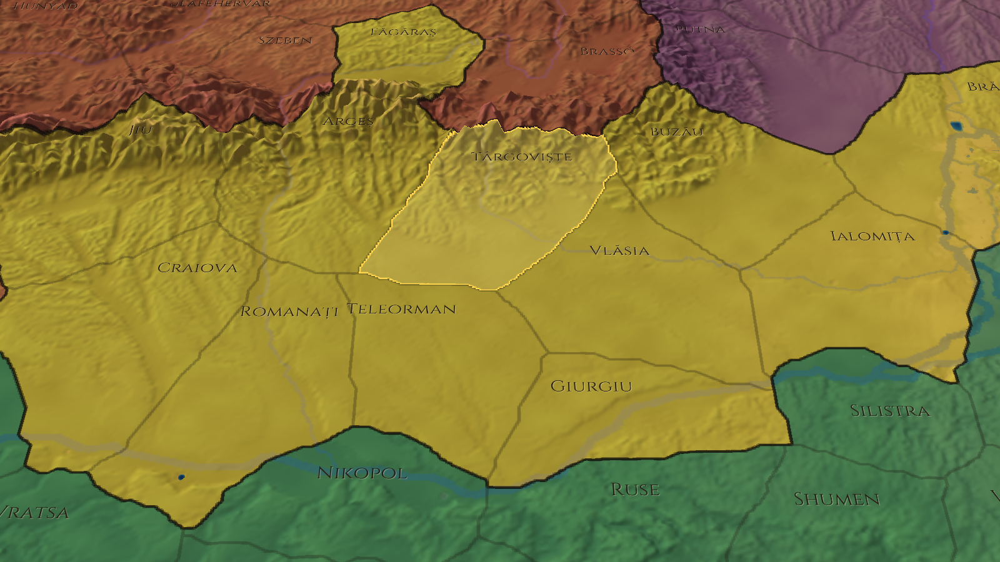
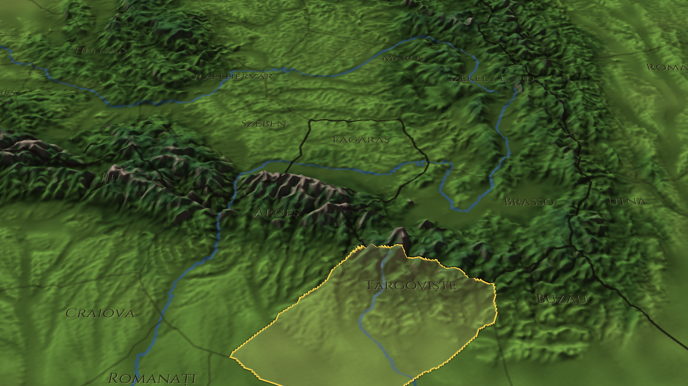

# Crowns of the Balkans — jocul nou (în lucru)

Joc de mare strategie istoric, fără elemente fantastice: Balcanii, Dunărea și Anatolia după bătălia de la
Ankara (iulie 1402). Se inspiră din Europa Universalis și Crusader Kings pentru campanie și din Total War
pentru bătălii. Textele din joc sunt în engleză.

Jocul vechi cu legende (`legendele/`) rămâne în depozit până când cel nou devine jucabil.






## Deciziile de bază

| Ce | Alegerea |
|---|---|
| Grafica | 3D cu Panda3D (Python): relieful real, cameră care se înclină, se rotește și se apropie |
| Timpul | Ture lunare (septembrie 1402 → 1500 și mai departe) |
| Startul | Septembrie 1402: Interregnul otoman, statele mici au o șansă |
| Harta | Balcanii, Dunărea, toată Ungaria, sudul Poloniei și al Lituaniei, Crimeea, Anatolia, Caucazul de vest |
| Ritmul | Războaiele se încheie cu păci negociate (scor de război), nu cu cucerirea tuturor provinciilor |
| Bătăliile | La început se rezolvă automat pe hartă; bătăliile tactice 3D vin la final |

## Harta (etapa B1)

- **Relief real:** altitudinile vin din Mapzen Terrain Tiles (date deschise, de pe AWS). Coastele, râurile
  și lacurile vin din Natural Earth (domeniu public). Proiecția e echidistantă, fidelă la 42,5°N, cu
  1,5 km pe pixel (1778 × 1312 pixeli). Relieful e exagerat de 8 ori, ca pe orice hartă de strategie.
- **Culoarea pământului** e calculată din relief și climă: stepa ucraineană, podișul anatolian, câmpiile
  Ungariei, pădurile Carpaților și ale Balcanilor, stâncă și zăpadă pe crestele înalte.
- **320 de provincii** în 1402, pe 66 de state și stăpâniri: regate, despotate, beylik-uri, republici
  maritime, ordine cavalerești, principate albaneze și marii nobili ai Bosniei. Lista e în
  `tools/history_1402.py`.
- **Granițele** nu sunt desenate de mână. Fiecare provincie crește din orașul ei peste relief, iar munții,
  râurile mari, marea și strâmtorile o frânează, așa că granițele se așază pe creste și pe râuri.
  Instrumentul e `tools/provinces.py`.
- **Moduri de hartă:** `1` relief, `2` politic. Granițele, selecția și culorile se calculează pe placa
  video, deci o cucerire se vede imediat.

```bash
pip install -r requirements.txt
python -m crowns                 # harta 3D (WASD/săgeți, rotița, clic dreapta tras sau Q/E, clic stânga)
python -m crowns --shots DIR     # capturi de verificare, fără ecran
python tools/terrain.py          # descarcă relieful și apele, refac harta de altitudini
python tools/provinces.py        # refac provinciile după tools/history_1402.py
```

## Etapele

| Etapă | Ce aduce |
|---|---|
| **B1 — Harta 3D** (în lucru) | relief, ape, provincii, granițe, nume, cameră, selecție |
| **B2 — Lumea în 1402** | toate statele cu conducătorii, dinastiile, vasalii și tributul lor; dezvoltarea provinciilor |
| **B3 — Campania** | ture lunare, economie, clădiri, armate pe hartă, asedii, războaie și păci, diplomație, AI |
| **B4 — Oameni** | conducători și moștenitori care îmbătrânesc și mor, dinastii, căsătorii, nobili |
| **B5 — Istoria** | misiuni pentru fiecare țară, evenimente istorice (Interregnul, Varna, Constantinopol), decizii |
| **B6 — Interfața și sunetul** | ferestre în stil medieval, sfaturi, muzică cu instrumente reale |
| **B7 — Bătălii tactice 3D** | după ce campania e gata |
| **B8 — Lansarea** | executabil pentru Windows, echilibru |
