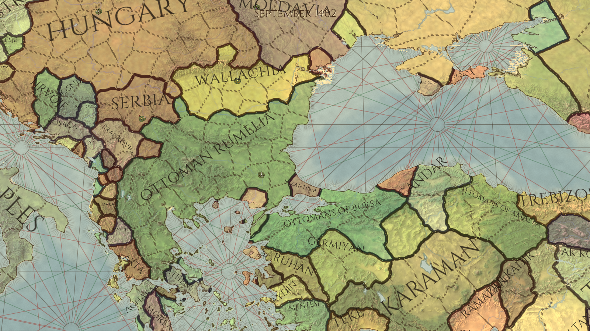
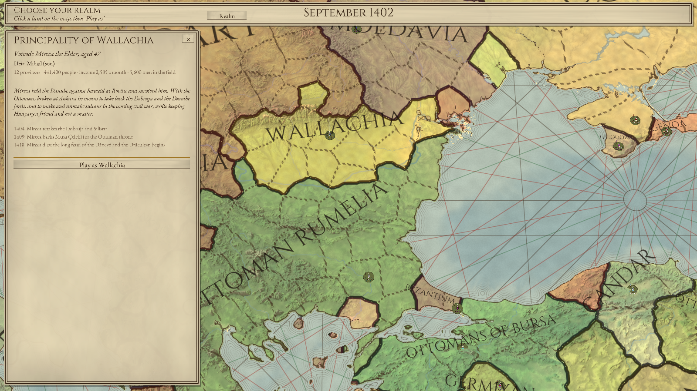
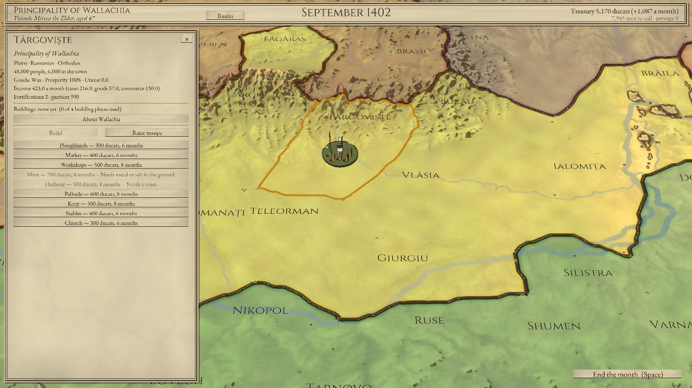
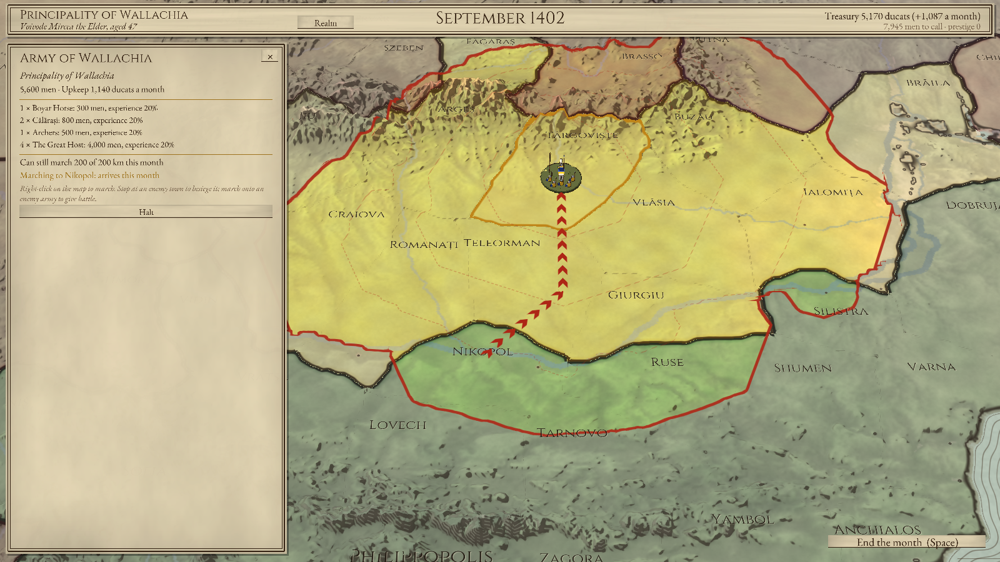
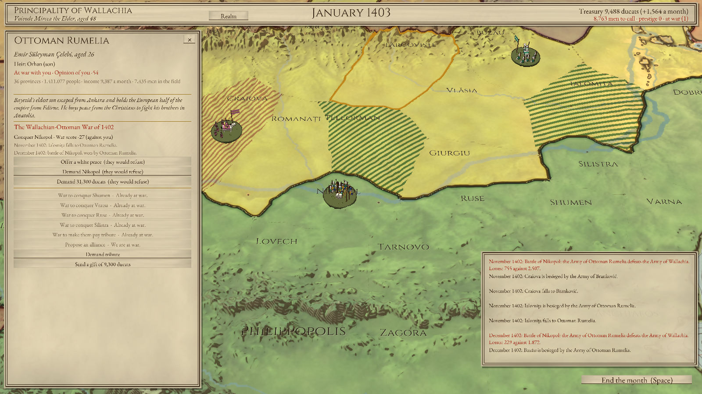
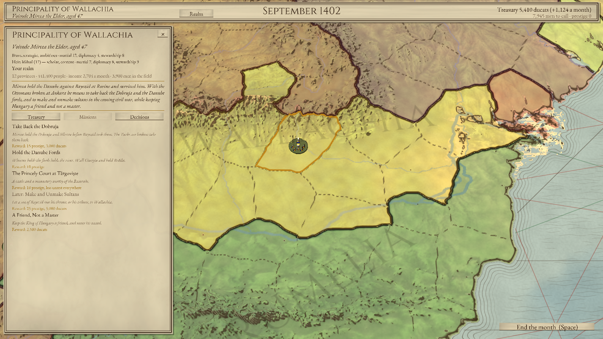

# Crowns of the Balkans — jocul nou (în lucru)

Joc de mare strategie istoric, fără elemente fantastice: Balcanii, Dunărea și Anatolia după bătălia de la
Ankara (iulie 1402). Se inspiră din Europa Universalis și Crusader Kings pentru campanie și din Total War
pentru bătălii. Textele din joc sunt în engleză.

Jocul vechi cu legende (`legendele/`) rămâne în depozit până când cel nou devine jucabil.











## Deciziile de bază

| Ce | Alegerea |
|---|---|
| Grafica | 3D cu Panda3D (Python): relieful real, cameră care se înclină, se rotește și se apropie |
| Timpul | Ture lunare (septembrie 1402 → 1500 și mai departe) |
| Startul | Septembrie 1402: Interregnul otoman, statele mici au o șansă |
| Harta | Balcanii, Dunărea, toată Ungaria, sudul Poloniei și al Lituaniei, Crimeea, Anatolia, Caucazul de vest |
| Ritmul | Războaiele se încheie cu păci negociate (scor de război), nu cu cucerirea tuturor provinciilor |
| Bătăliile | La început se rezolvă automat pe hartă; bătăliile tactice 3D vin la final |
| Stilul | „Codex”: harta e o hartă portulan gravată și colorată de mână, pe pergament. Armatele sunt figurine pictate 3D, cu contur de cerneală |
| Mișcarea | Ca în Total War: armatele merg liber pe hartă, cu un buget lunar de marș |

## Stilul „Codex”

Ca să nu semene cu Europa Universalis sau Crusader Kings, harta arată ca un manuscris din secolul al XV-lea:
pergament, relief desenat cu hașuri de cerneală care se îndesesc la umbră, state colorate în acuarelă care
se adună mai închis la margini, granițe trase cu pana (punctate între provincii, ferme între state). Marea
are liniile de coastă gravate și liniile de vânt ale hărților portulane, pornind din roze ale vânturilor.
Armatele sunt miniaturi pictate: un călăreț și pedestrași pe un soclu, cu steagul statului care flutură.

## Lumea în 1402 (etapa B2)

- **64 de state** (`tools/realms_1402.py` → `crowns/data/realms.json`). Fiecare are: numele întreg, forma
  de guvernare, titlul conducătorului, rangul (imperiu, regat, ducat, comitat), capitala, conducătorul cu
  dinastia și anul nașterii, moștenitorul, soția sau soțul, suzeranul (vasal, tributar, protectorat sau
  uniune), situația din 1402 și ce urmărește, plus evenimentele care l-au așteptat în istorie.
  Unde izvoarele nu se pun de acord, intrarea o spune.
- **28 de relații** în curs: Sigismund contra lui Ladislau de Neapole, uniunea polono-lituaniană, frații
  otomani, Ștefan Lazarević contra Brankovićilor, Veneția contra Genovei și altele.
- **Provinciile** au acum relieful lor (câmpie, deal, munte, pădure, stepă, mlaștină, deșert), populația
  estimată pentru 1402 (vreo 21 de milioane de oameni pe toată harta), orașul mare, marfa (grâu, vite, vin,
  sare, argint, aur, mătase…) și cetatea.

## Mișcarea armatelor

Pământul e o rețea de pătrate de 3 km. Câmpia se străbate ușor; pădurea, dealul, muntele și mlaștina cer
mai mult. Râurile mari (Dunărea, Nistrul, Niprul, Tisa, Sava…) se trec greu, cu bărci, în afara vadurilor
și podurilor istorice (Nicopole, Giurgiu, Vidin, Silistra, Belgrad…). Strâmtorile se trec cu bacul. Când
alegi o armată, harta arată cu cerneală roșie până unde poate ajunge luna asta și o linie fină pentru
fiecare săptămână de marș. Statele cu flotă (Veneția, Genova, Cavalerii, Ciprul, Bizanțul, otomanii,
mamelucii…) și cele care și-au construit un port își pot urca oastea pe corăbii oriunde pe coastă:
îmbarcarea durează cam o săptămână, iar pe mare se merge de patru ori mai repede. Cu clic dreapta îi dai
ordin. Merge cât poate luna asta, iar restul drumului
rămâne ordin pentru lunile următoare, cu săgeți și apoi puncte. Tasta Space încheie luna.

## Harta (etapa B1)

- **Relief real:** altitudinile vin din Mapzen Terrain Tiles (date deschise, de pe AWS). Coastele, râurile
  și lacurile vin din Natural Earth (domeniu public). Proiecția e echidistantă, fidelă la 42,5°N, cu
  1,5 km pe pixel (1778 × 1312 pixeli). Relieful e exagerat de 8 ori, ca pe orice hartă de strategie.
- **Culoarea pământului** e calculată din relief și climă: stepa ucraineană, podișul anatolian, câmpiile
  Ungariei, pădurile Carpaților și ale Balcanilor, stâncă și zăpadă pe crestele înalte.
- **320 de provincii** în 1402, pe 64 de state și stăpâniri: regate, despotate, beylik-uri, republici
  maritime, ordine cavalerești, principate albaneze și marii nobili ai Bosniei. Lista e în
  `tools/history_1402.py`.
- **Granițele** nu sunt desenate de mână. Fiecare provincie crește din orașul ei peste relief, iar munții,
  râurile mari, marea și strâmtorile o frânează, așa că granițele se așază pe creste și pe râuri.
  Instrumentul e `tools/provinces.py`.
- **Moduri de hartă:** `1` relief, `2` politic. Granițele, selecția și culorile se calculează pe placa
  video, deci o cucerire se vede imediat.

```bash
pip install -r requirements.txt
python -m crowns                 # campania: alegi un stat pe hartă și îl conduci
python -m crowns --realm hungary # direct cu un stat (wallachia, moldavia, hungary, ott_rum, serbia, venice…)
python -m crowns --shots DIR     # capturi de verificare, fără ecran
python tools/terrain.py          # descarcă relieful și apele, refac harta de altitudini
python tools/provinces.py        # refac provinciile după tools/history_1402.py
python tools/realms_1402.py      # refac crowns/data/realms.json
```

## Campania (etapa B3)

Fiecare tură e o lună. Joci un stat și toate celelalte sunt conduse de AI.

- **Banii:** taxe de la oameni, valoarea mărfii fiecărei provincii (grâu, vite, vin, sare, argint, aur,
  mătase…) și comerțul orașelor; se plătesc curtea, armatele, zidurile noi și tributul către suzeran.
  Statele care trec dincolo de marginea hărții (mamelucii cu Egiptul, Timur, Hoarda, Polonia, Lituania,
  Genova) primesc și venitul de acolo.
- **Clădiri:** 9 feluri, fiecare cu 3 niveluri (ogoare, târg, meșteșugari, mină, port, ziduri, cetate,
  grajduri, biserică sau moschee). Se construiesc în luni, o lucrare odată pe provincie; orașele mari au
  loc pentru mai multe.
- **Oaste:** 7 tradiții militare. Țara Românească și Moldova au boieri, călărași, arcași și oastea cea
  mare; latinii au cavaleri, oșteni în armură și arbaletrieri; otomanii au sipahi, akıncı, azapi și
  ieniceri; Hoarda are arcași călare; mamelucii, cavaleria de elită. Recruții vin luna următoare.
- **Război:** se declară cu un scop (o provincie, tribut sau independență). Suzeranul, vasalii și aliații
  sunt chemați. Armatele care se întâlnesc dau bătălie, iar terenul contează (cavaleria e bună la câmpie,
  pedestrimea la munte). O armată oprită la un oraș dușman îl asediază câteva luni, după ziduri și
  garnizoană, mai încet iarna. Iarna în țară străină omoară oameni. Bătăliile, pământul ținut și scopul
  războiului dau scorul de război, iar scorul hotărăște ce pace acceptă fiecare.
- **Diplomație:** opinia dintre state ține de credință, de vechile prietenii și dușmănii, de granițe și de
  războaiele recente. Poți face alianțe, cere tribut unui vecin mult mai slab și trimite daruri.
- **AI-ul** construiește, recrutează, atacă vecinii slabi pe care nu-i iubește, asediază, se retrage din
  fața armatelor mai mari și face pace când scorul o cere. Îți poate oferi pace: primești o întrebare.
- **Salvare:** F5 salvează, F9 încarcă.

## Oamenii (etapa B4)

Fiecare conducător din 1402 e o persoană: are casă (dinastie), vârstă și trăsături luate din cronici
(Mircea e viteaz, strateg și ambițios; Sigismund e ambițios și viclean; Ștefan Lazarević e învățat și
evlavios). Are și priceperi la război, diplomație și administrare. Oamenii îmbătrânesc și mor, cei
căsătoriți au copii, iar casele domnitoare își mărită copiii între ele, ceea ce apropie țările. Poți
propune căsătorii din foaia altui stat.

La moartea conducătorului urmează moștenitorul: cel desemnat, apoi fiul, fratele, nepotul, fiica unde
femeile pot domni, iar la tătari cel mai vârstnic din neam. Cine moștenește o a doua țară o unește cu prima
(Sigismund moștenește Boemia). Republicile își aleg conducătorul, papii își iau nume papale numerotate.
Când neamul se stinge, preia tronul un văr sau, dacă nu se găsește niciunul, o casă nouă, iar țara se
frământă. Fiecare armată are un căpitan: priceperea lui contează în bătălie și poate muri în luptă.

## Istoria (etapa B5)



- **Evenimente istorice**, cu alegeri pentru jucător:
  - Timur ia Smirna, apoi pleacă din Anatolia și moare în 1405;
  - Baiazid moare prizonier, Tratatul de la Gallipoli, bătălia pentru Bursa, Süleyman trece în Anatolia;
  - Ladislau încoronat la Zara, Grunwald, Conciliul de la Constanța, arderea lui Hus și husiții;
  - Iancu de Hunedoara, Skanderbeg, cruciada de la Varna;
  - căderea Constantinopolului, dacă se ajunge acolo.
- **Întâmplări**: ciuma (pornește dintr-un port mare și se întinde), foametea, recoltele bogate și
  răscoalele țărănești acolo unde nemulțumirea e mare.
- **Misiuni** proprii fiecărei țări, după ce urmărea în 1402. Exemple:
  - Țara Românească: Dobrogea, vadurile Dunării, „să faci și să desfaci sultani”;
  - Moldova: porturile Mării Negre și ieșirea de sub Polonia;
  - Ungaria: Belgradul și omagiul voievodului;
  - fiii lui Baiazid: reunirea casei lui Osman;
  - Bizanțul: Tesalonicul și zidurile.

  Statele fără misiuni proprii primesc unele potrivite locului lor.
- **Decizii**: Ordinul Dragonului, sprijinul pentru Musa Celebi, proclamarea Sultanatului, Hexamilionul,
  Unirea Bisericilor, proclamarea unui regat, Belgradul capitală, căutarea unui protector.

## Muzica și sunetele (etapa B6)

Cinci piese originale în stilul sfârșitului de Ev Mediu, cântate cu instrumente reale eșantionate
(SoundFont-ul GeneralUser GS, de S. Christian Collins, liber de folosit) și cu ecoul unei săli de piatră:

| Piesa | Ce este | Instrumente |
|---|---|---|
| *The Danube* | estampie în modul doric, pentru țările creștine | flaut drept, fidel, lăută, harpă, tobă cu ramă |
| *The Crescent* | maqam Hijaz, cu taqsim și ritmul maqsum, pentru lumea otomană | ney, oud, kanun, darbuka |
| *The Court* | piesă lentă pentru vremuri de pace | harpă, flaut drept, violoncel |
| *War Banners* | marș de război în modul mixolidian | șalmei, cimpoi, trompetă, tobe |
| *Doina* | doină și horă, pentru Țara Românească și Moldova | nai, fidel, cobză, tobă |

Muzica urmează starea țării tale: doina și Dunărea pentru români, *The Crescent* pentru otomani și
tătari, marșul când ești în război. Mai sunt sunete pentru butoane, sfârșitul lunii, marș, victorie,
înfrângere, evenimente și construcții. Tasta M oprește sau pornește muzica. Piesele se refac cu
`python tools/music.py` (are nevoie de `pip install --no-deps tinysoundfont` și de ffmpeg).

## Etapele

| Etapă | Ce aduce |
|---|---|
| **B1 — Harta 3D** (gata) | relief, ape, provincii, granițe, nume, cameră, selecție |
| **B2 — Lumea în 1402** (gata) | toate statele cu conducătorii, dinastiile, vasalii și tributul lor; dezvoltarea provinciilor |
| **B3 — Campania** (jucabilă; urmează echilibrul) | ture lunare, economie, clădiri, armate pe hartă, asedii, războaie și păci, diplomație, AI |
| **B4 — Oameni** (gata) | conducători și moștenitori care îmbătrânesc și mor, dinastii, căsătorii, nobili |
| **B5 — Istoria** (gata, se va tot îmbogăți) | misiuni pentru fiecare țară, evenimente istorice (Interregnul, Varna, Constantinopol), decizii |
| **B6 — Interfața și sunetul** (muzica e gata) | ferestre în stil medieval, sfaturi, muzică cu instrumente reale |
| **B7 — Bătălii tactice 3D** | după ce campania e gata |
| **B8 — Lansarea** | executabil pentru Windows, echilibru |
