# Legendele Carpaților (*Legends of the Carpathians*)

Joc indie de strategie în stilul Total War, inspirat din folclorul românesc. Șase legende își
dispută Carpații: **The Principality** (Voievodatul), **The Dragonkin** (Zmeii), **The Fae Court** (Ielele),
**The Revenants** (Strigoii), **The Outlaws** (Haiducii) și **The Solomonari** (Solomonarii).
Textele din joc sunt în engleză.

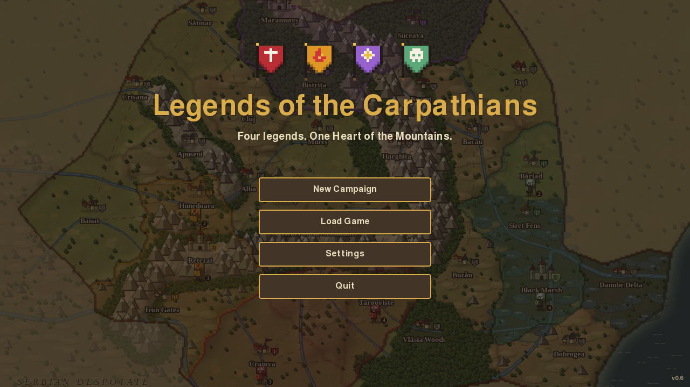

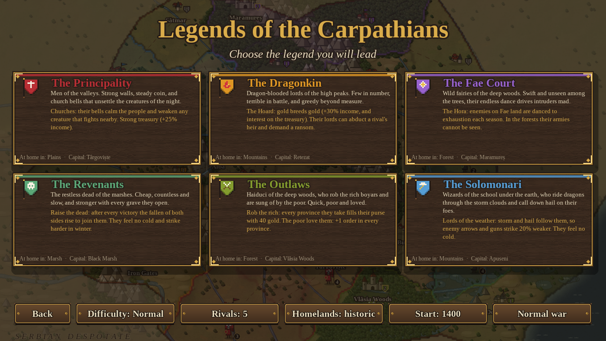

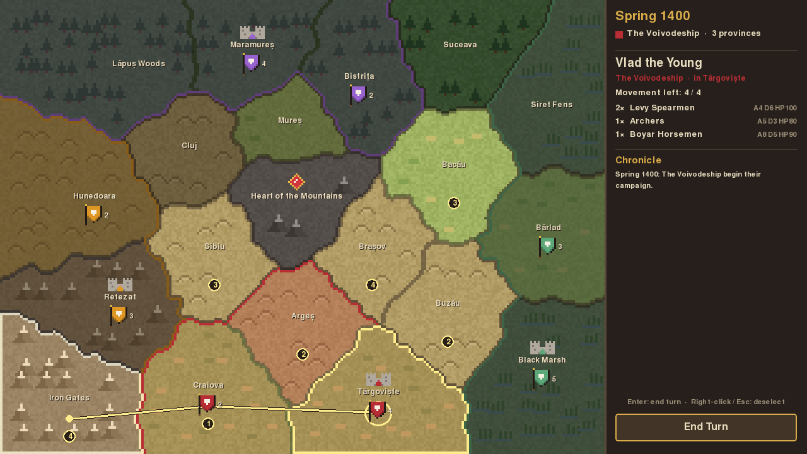

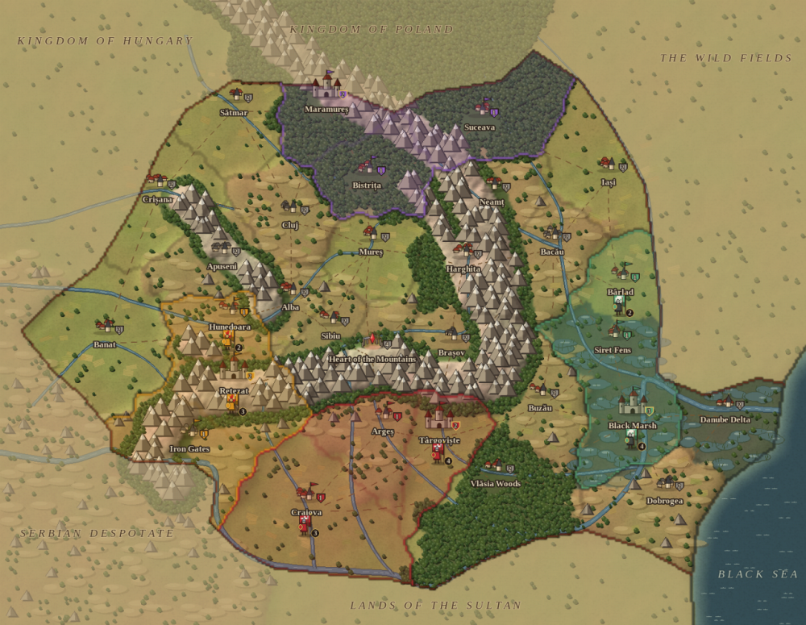

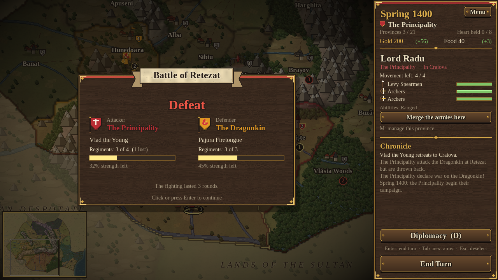

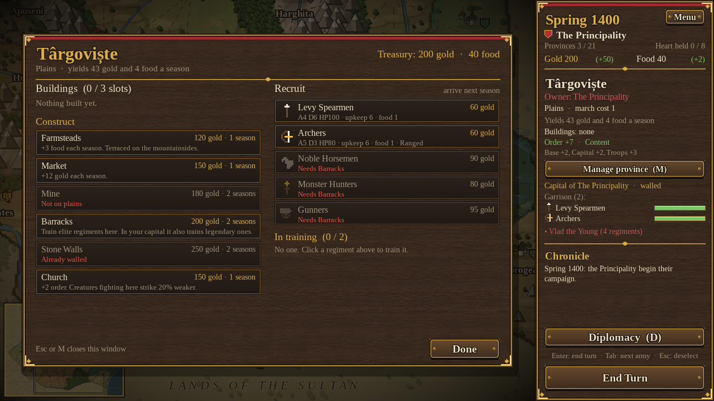

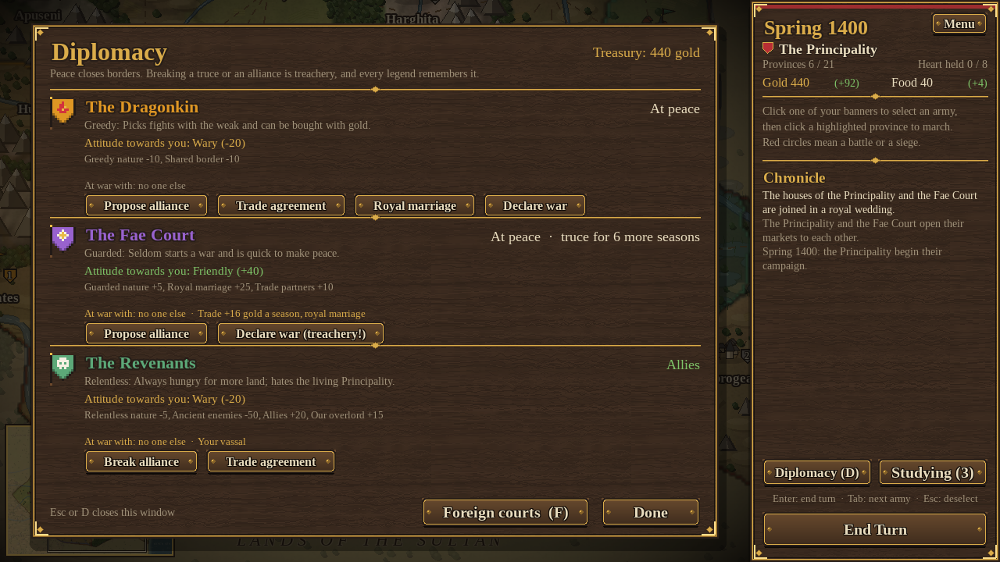

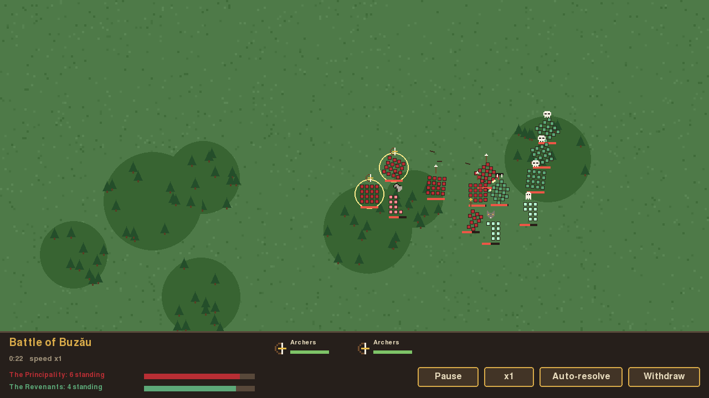

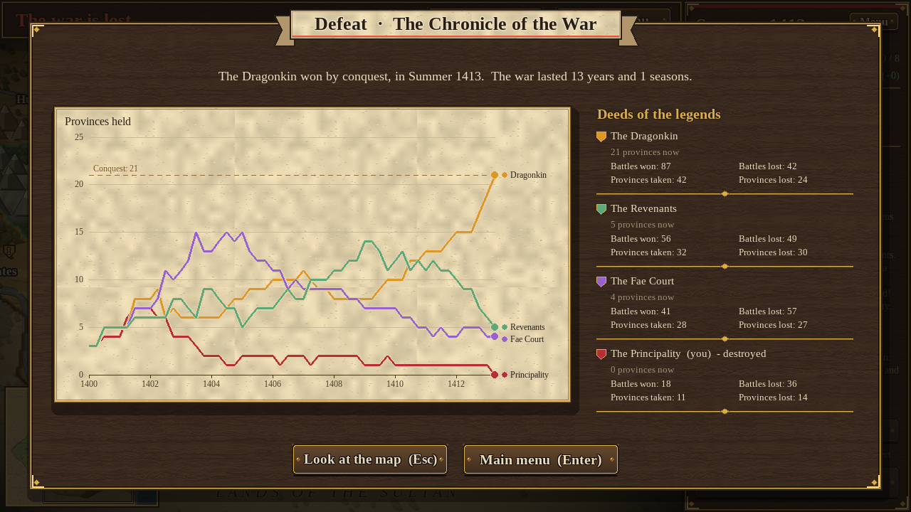

Designul complet și planul pe etape sunt în [DESIGN.md](DESIGN.md).

## Cum pornești jocul

**Pe Windows, fără Python:** descarci `LegendsOfTheCarpathians.zip` de la secțiunea *Releases* a depozitului
(sau din ultima rulare a workflow-ului **Build Windows**, la *Actions*), îl dezarhivezi și pornești
`LegendsOfTheCarpathians.exe`.

**Din surse:** ai nevoie de Python 3.10 sau mai nou.

```bash
pip install -r requirements.txt
python -m legendele
```

### Comenzi

| Acțiune | Cum |
|---|---|
| Selectezi o armată | clic pe steagul ei |
| Mărșăluiești | cu armata selectată, clic pe o provincie luminată (cercul arată costul) |
| Treci la următoarea armată | `Tab` (harta se mută pe ea) |
| Derulezi harta | săgețile, mouse-ul la marginea hărții sau tragi cu rotița apăsată |
| Sari oriunde pe hartă | clic pe harta mică din colț |
| Te întorci la capitală | `Home` sau `C` |
| Inspectezi o provincie | clic pe ea (sau ții mouse-ul deasupra) |
| Deselectezi | clic dreapta sau `Esc` |
| Meniul (salvare, încărcare, setări) | butonul **Menu** sau `Esc` când nu e nimic selectat |
| Bătălia în timp real | vezi mai jos, la M7 |
| Administrezi o provincie | **Manage province** sau `M` |
| Diplomația | **Diplomacy** sau `D` |
| Curțile străine (tribut, mercenari) | `F` sau din Diplomacy |
| Tradițiile (cercetare) | `T` sau butonul **Traditions** |
| Misiunile și eroii | `L` sau butonul **Legends** |
| Agenții | clic pe jetonul agentului, apoi clic pe o provincie luminată; acțiunile apar în panou |
| Termini tura | butonul **End Turn**, `Enter` sau `Space` |

## Stadiul actual: etapa M15 (finisaj)

**Harta și mișcarea**
- Hartă fixă cu 30 de provincii și 5 tipuri de teren, pe geografia reală a României: Carpații în arc,
  Dunărea, Delta, Marea Neagră și râurile mari, cu ținuturile vecine (Ungaria, Polonia, Serbia, Sultanul)
  desenate estompat dincolo de graniță. Harta e mai mare decât ecranul și se derulează; o hartă mică arată tot.
- Armatele au 4 puncte de mișcare pe tură. Câmpia costă 1, dealurile, pădurea și mlaștina 2, munții 3.
  Fiecare facțiune se mișcă ieftin (cost 1) pe terenul ei: Dragonkin și Solomonari prin munți, Fae Court și
  Outlaws prin păduri, Revenants prin mlaștini. Excepție: Inima Munților nu aparține niciunei legende.
- Prin provinciile tale treci liber. Intrarea în orice altă provincie oprește marșul.
  Cercul de pe hartă e **auriu** pentru un marș liber și **roșu** dacă te așteaptă o luptă sau un asediu.

**Războiul**
- **Bătălii calculate automat.** Contează atacul și apărarea unităților, terenul, zidurile,
  generalul, terenul de acasă și moralul. O tabără fuge când pierde mai mult decât poate îndura.
  Înainte de atac, panoul îți arată o **prognoză**: victorie clară, victorie costisitoare sau înfrângere probabilă.
- **Cucerire:** o provincie fără apărare devine a ta când intri în ea.
- **Asedii:** provinciile neutre sunt păzite de răsculați (Rebels), iar capitalele au ziduri și garnizoană.
  Armata ta rămâne la asediu și apărătorii slăbesc în fiecare anotimp. Poți da și asaltul (butonul **Assault the walls**).
- **Retragere:** cine pierde se retrage într-o provincie vecină care e a lui. Dacă nu are unde, armata e distrusă.
- Regimentele se refac câte puțin în fiecare tură pe teritoriul propriu.
- **Raport de bătălie** după fiecare luptă la care participi.

**Victorie și înfrângere**
- **Cucerire:** 21 din 30 de provincii (15 sau 26 într-un război scurt sau lung, vezi opțiunile de start).
- **Victorie de legendă:** ții Inima Munților și capitala ta 8 ture la rând.
- O facțiune care își pierde toate provinciile e eliminată. Dacă ești tu, ai pierdut.

**AI-ul** alege ținte valoroase și apropiate (Inima Munților, capitalele dușmane), își calculează
șansele cu aceeași formulă de luptă și atacă doar când crede că poate câștiga.

**Economia**
- **Aur și hrană**, afișate sus în panou, cu câștigul sau pierderea pe tură.
  Aurul vine din taxe și clădiri și pleacă pe întreținerea armatelor. Hrana vine din teren și ferme,
  iar unitățile mari mănâncă mai mult.
- **Provinciile tale:** selectează una și apasă **Manage province** (sau `M`). Fereastra are două părți:
  - **construcții:** Farmsteads, Market, Mine, Barracks, Stone Walls (3 locuri, gata în 1–2 anotimpuri);
  - **recrutare:** cel mult 2 regimente pe tură, care sosesc în anotimpul următor.
    Unitățile de nivel 2 cer Barracks, iar cele de nivel 3 și eroii cer Barracks în capitală.
- **Armate noi:** recruții se alătură armatei din provincie sau pornesc o armată nouă, cu un general nou.
  Armatele aflate în aceeași provincie se pot uni (**Merge the armies here**), până la 12 regimente.
- **Garnizoane:** orașele cu ziduri își refac garnizoana, celelalte provincii ridică o miliție.
  Orice cucerire cere acum un asediu sau un asalt.
- **Anotimpurile contează:** vara aduce o recoltă bogată, iarna hrană puțină și zăpadă pe hartă.
  Armatele aflate iarna departe de casă pierd oameni din cauza frigului, mai puțin Revenants.
- **Lipsuri:** fără hrană armatele flămânzesc, iar cu tezaurul pe minus soldații dezertează.
- **AI-ul** construiește, recrutează fără să intre pe minus și vânează facțiunea care ține Inima Munților.

**Legendele (M4)**

Fiecare facțiune are o putere a ei. Pe ecranul de start o vezi scrisă cu auriu.

| Facțiune | Puterea |
|---|---|
| **The Principality** | **Church** (doar ei o pot construi): +2 ordine, iar creaturile care luptă în provincie lovesc cu 20% mai slab. Au +35% venit și se simt acasă pe câmpie. |
| **The Dragonkin** | **Comoara**: tezaurul aduce dobândă (5%, maximum 15 aur, +15 cu fiecare **Dragon Hoard**). **Răpirea**: o armată aflată lângă capitala unui rival îi poate fura moștenitorul, pentru 150 de aur răscumpărare (o dată la 6 anotimpuri; dacă eșuează, armata pierde oameni). |
| **The Fae Court** | **Hora**: armatele dușmane aflate pe pământul lor pierd 2% din oameni în fiecare anotimp (dublu lângă un **Fairy Ring**). În păduri armatele lor nu se văd decât dacă ai o armată aproape. |
| **The Revenants** | **Ridicarea morților**: după fiecare victorie, o parte din morții ambelor tabere se ridică drept Risen Dead (+1 lângă o **Crypt**). Nu simt frigul și iarna lovesc cu 15% mai tare. |
| **The Outlaws** (M14) | **Jefuiesc bogații**: fiecare provincie cucerită le aduce 60 de aur. **Iubiți de popor**: +1 ordine în toate provinciile (+1 și cu **Greenwood Hideout**, +10 aur). Se simt acasă în păduri. |
| **The Solomonari** (M14) | **Stăpânii vremii**: furtuna și grindina îi urmează, așa că săgețile și gloanțele dușmanilor lovesc cu 30% mai slab. Nu simt frigul, se simt acasă în munți și au **Weather Tower** (+1 ordine, +2 hrană). |

**Abilitățile unităților** contează acum în luptă: Ranged, Charge, Frenzy, Monster Bane, Forest Ambush,
Flying Fire (zidurile nu apără de foc), Life Drain (vampirii se vindecă), Dread, Enchanting Dance,
Healing și Hero. Le vezi în panoul armatei și în fereastra de recrutare.

**Ordinea publică și răsculații (Rebels)**
- Fiecare provincie are o **ordine**, afișată în panou împreună cu motivele. Ordinea crește cu trupele staționate,
  cu clădirile (Church, Fairy Ring, Crypt, Dragon Hoard, Stone Walls) și în capitală.
  Scade în provinciile proaspăt cucerite, când e foamete și când tezaurul e pe minus.
- Sub zero, provincia se poate **răscula**: apar Rebels care atacă garnizoana. Dacă câștigă,
  provincia redevine liberă (neutră), iar rebelii îi devin garnizoană.
- Concluzia: după o cucerire, lasă trupe în provincie câteva anotimpuri.

**Diplomația (M5)**
- Toți pornesc **în pace**. Pacea închide granițele: nu poți intra pe pământul cuiva cu care ești în pace
  și nu-i poți ataca armatele. Pământul neutru și răsculații rămân deschiși oricui.
- Fereastra **Diplomacy** (butonul din panou sau tasta `D`) arată, pentru fiecare facțiune, relația, personalitatea,
  **atitudinea față de tine** cu toate motivele ei și cu cine mai e în război. De acolo poți:
  - oferi pace (gratuit sau cu 100 de aur);
  - propune o alianță;
  - declara război;
  - rupe o alianță.
- **Alianțele** deschid drumurile prin teritoriul aliatului și sunt defensive: cine îți atacă aliatul intră în război și cu tine.
- **Armistițiul și trădarea:** după pace urmează un armistițiu de 6 anotimpuri. Dacă îl rupi, sau îți ataci aliatul,
  e trădare, și toate facțiunile te vor plăcea mai puțin.
- **Solii AI-ului** vin cu oferte de pace sau alianță. Răspunzi cu **Accept (Y)** sau **Decline (N)**.

**AI-ul (M5)**
- Fiecare facțiune are o **personalitate**:
  - Principality: **Steadfast**, își ține cuvântul;
  - Dragonkin: **Greedy**, atacă vecinii slabi, dar se lasă cumpărată cu aur;
  - Fae Court: **Guarded**, pornește rar războaie;
  - Revenants: **Relentless**, mereu flămânzi de pământ.
- Calculatorul cere pace când pierde, caută aliați, declară război vecinilor mai slabi și formează **coaliții**
  împotriva celui care se apropie de victorie.
- Pe câmpul de luptă, armatele se întorc să-și apere capitala amenințată și se unesc când ajung în aceeași provincie.

**Aspectul (M6)**
- **Meniul principal:** Continue (reia ultima salvare), New Campaign, Load Game, Settings, Quit.
- **Salvare și încărcare:** 3 sloturi plus o **salvare automată** la fiecare tură. Meniul din joc se deschide
  cu butonul **Menu** sau cu `Esc`, când nu e nimic selectat. Salvările sunt fișiere JSON în `~/.legendele/saves/`.
- **Setări:** volumul efectelor, volumul muzicii și ecranul complet. Se păstrează în `~/.legendele/settings.json`.
- **Sunet generat din cod, fără fișiere audio:**
  - efecte pentru clicuri, marșuri, bătălii, construcții, recrutări, tura nouă, alarme, aur și pace;
  - **muzică** în stil de doină, pe dronă, cu câte un mod popular pentru fiecare legendă.
  Fără placă de sunet, jocul merge în liniște.
- **Pixel art:** steagurile poartă emblema facțiunii (cruce, flacără, floare, craniu), fiecare unitate are
  pictograma ei, iar armatele alunecă pe hartă când mărșăluiesc.
- Orice sprite, sunet sau temă muzicală se poate înlocui cu propriile fișiere: vezi
  [legendele/assets/README.md](legendele/assets/README.md).

**Bătăliile în timp real (M7)**
- Când armata ta e implicată într-o bătălie, jocul te întreabă: **Lead the battle (B)** sau **Auto-resolve (A)**.
  Fereastra arată și prognoza rezolvării automate. Din **Settings** poți alege să fii întrebat de fiecare dată,
  să conduci mereu sau să rezolvi mereu automat.
- **Pe câmpul de luptă:**

  | Acțiune | Cum |
  |---|---|
  | Selectezi regimente | clic sau dreptunghi tras cu mouse-ul (`Shift` adaugă la selecție, `A` le ia pe toate) |
  | Mărșăluiești | clic dreapta pe teren |
  | Ataci | clic dreapta pe un inamic |
  | Oprești pe loc | `H` |
  | Desfășurare (înainte de luptă) | tragi regimentele în zona luminată sau clic dreapta pentru cele selectate; `Space` începe lupta |
  | Ordinul special al regimentului | `Q` sau butonul din bara de jos (are reîncărcare) |
  | Pauză | `Space` |
  | Viteză x1, x2, x4 | `F` |
  | Zoom | rotița mouse-ului sau `+` / `-`; harta se mută cu săgețile, mouse-ul la margine sau rotița apăsată |

  Butoanele **Auto-resolve** (calculatorul termină lupta) și **Withdraw** (retragere) sunt în bara de jos.
- **Cum arată:** un câmp pictat după terenul provinciei, cu sute de soldați desenați unul câte unul, în
  formații. Ei pășesc, lovesc și cad (cei căzuți rămân pe câmp). Săgețile zboară în arc, tunurile fac fum,
  cavaleria ridică praf, balaurii scuipă foc, iar umbrele norilor trec peste câmp.

  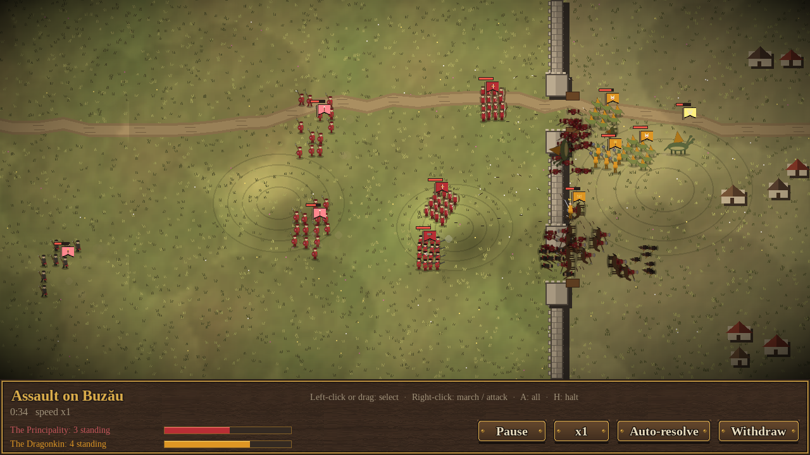
- **Ce contează:**
  - **flancarea:** o lovitură din lateral e +30%, una din spate +60%, și amândouă sperie;
  - **șarjele:** cavaleria, Wrathful Sprites și Mace Drakes lovesc mai tare în primele secunde;
  - **arcașii** trag de la distanță, dar pădurea îi apără pe cei ținuți la țintă;
  - **terenul:** dealurile ajută apărarea, pădurile și mlaștinile încetinesc, stâncile din munți blochează drumul;
  - **asalturile:** apărătorii stau după ziduri, iar atacatorii trebuie să treacă prin porți
    (Three-Headed Wyrms ard peste ziduri);
  - **moralul:** un regiment fuge când pierderile lui, ale armatei și flancările îl copleșesc;
  - **abilitățile** (Life Drain, Dread, Enchanting Dance, Healing, Hero) funcționează și aici, în jurul unității.
- Pierderile și învingătorul se întorc în campanie exact ca după o bătălie automată.
  Dacă timpul (5 minute de luptă) expiră, apărătorii păstrează câmpul.

**Claritate (M8)**
- **Tooltip-uri:** ține mouse-ul o clipă pe aur, hrană, ordine publică, regimente, abilități, clădiri,
  atitudinea celorlalte legende, steagurile armatelor de pe hartă sau regimentele de pe câmpul de luptă și
  afli ce înseamnă și de unde vin cifrele.
- **Veștile anotimpului:** după fiecare tură, o listă cu ce s-a întâmplat pe hartă cât au mutat ceilalți.
  Un clic pe un rând te duce acolo. Se poate opri din Settings.
- **Cronica războiului:** la final, un grafic cu provinciile fiecărei legende, anotimp cu anotimp (cu
  valorile la mouse), și faptele fiecăreia: bătălii câștigate și pierdute, provincii luate și pierdute.
  Se poate redeschide cu butonul **Chronicle**.
- **Dificultate** (Easy, Normal, Hard, Legendary), aleasă la începutul campaniei: schimbă aurul de
  început și taxele celorlalte legende.
- **Sfetnicul:** în prima campanie, bătrânul Neagu te învață pas cu pas (armate, marș, provincie,
  diplomație, sfârșitul turei). Îl poți sări oricând și îl poți readuce din Settings.

**Generali și veterani (M9)**
- **Generalii** câștigă experiență în bătălii (mai multă pentru o victorie, și mai multă pentru una
  împotriva unui dușman mai numeros) și urcă în grad, până la 8 stele. Fiecare stea: +3% atac și moral mai
  tare.
- **Trăsăturile** vin din fapte: o victorie în inferioritate poate face un general **Brave**, un asalt reușit
  **Siege Master**, o victorie împotriva creaturilor **Monster Slayer**, o iarnă de luptă **Winter Warrior**;
  o înfrângere îl poate face **Coward**, iar anotimpurile liniștite acasă îl pot face **Drunkard**, **Greedy**,
  **Frugal** sau **Beloved**. Sunt 15 trăsături, cel mult 3 pe general; unele schimbă mișcarea, solda,
  ordinea publică sau rezistența la iarnă.
- Un general poate **cădea în luptă**; locotenentul lui preia armata, fără grad și fără trăsături.
- **Regimentele veterane:** cele care supraviețuiesc bătăliilor primesc până la 3 chevroane (+8% atac și
  apărare și +5 moral fiecare). Le vezi lângă nume în panou și pe steag în bătălii.

**Harta vie (M10)**
- **Drumuri și râuri:** drumul dintre două provincii prietene costă un punct de mișcare mai puțin; un râu fără
  pod (unde nu e drum) costă unul în plus. Atacul peste un râu e mai slab (-10%, peste Dunăre -20%), iar în
  bătălia în timp real râul taie câmpul: cine îl trece prin vad merge încet și e mai ușor de lovit.
- **Întâmplări din folclor:** 16 evenimente cu alegeri, cum ar fi Sânzienele, Noaptea Sfântului Andrei, un
  strigoi în sat, ciuma, cometa, comoara lui Decebal, Zilele Babei Dochia, iarna lupilor, negustorii sași.
  Urmările: aur, hrană, ordine pentru câteva anotimpuri, regimente gratuite, trăsături pentru generali, armate
  rănite sau vindecate, ori un pariu cu norocul. Alegi cu clic sau cu tastele 1-3.
- **Puterile străine:** Regatul Ungariei, Regatul Poloniei, Sultanul și tătarii din Câmpia Sălbatică trimit
  din al treilea an incursiuni peste graniță (tot mai dese cu anii). Jefuiesc provinciile (aur, clădiri,
  liniște) și pleacă acasă cu prada. În **Foreign courts** (tasta F sau din Diplomacy) le poți plăti tribut ca
  să te lase în pace, iar regatele creștine vecine îți vând mercenari: Winged Hussars, Black Army Foot și
  Hungarian Knights.

**Bătălii tactice (M11)**
- **Desfășurarea:** înainte de luptă îți așezi regimentele în zona ta.
- **Ordine speciale:** fiecare regiment are un ordin special, cu reîncărcare: Charge!, Volley!, War cry,
  Dragon fire, Bewitching round, Dread wail, Midsummer blessing sau Brace!. Le folosește și AI-ul.
- **Vreme și noapte:** ploaia udă coardele arcurilor și praful de pușcă, zăpada încetinește pasul, ceața și
  noaptea scurtează bătaia arcașilor. Noaptea fiecare regiment are torțe, iar Revenants lovesc mai tare.
- **Întăriri:** o armată de-a ta (sau a dușmanului) din provincia vecină, care n-a mărșăluit în anotimpul
  ăsta, vine în ajutor și intră pe câmp după 30 de secunde.
- **Asedii:** porțile sunt închise. După un anotimp de asediu ai scări (oamenii urcă încet pe ziduri), după
  două și un berbec care sparge poarta (arcașii de pe ziduri încearcă să-l ardă). Balaurii zboară peste ziduri.
  Fără echipament, asaltul e mai slab și în rezolvarea automată.
- **Zoom** pe câmpul de luptă.
- **Bătălia personalizată** (din meniul principal): alegi cele două oști (inclusiv puterile străine sau
  Rebels), regimentele, terenul, asaltul, vremea, ora, echipamentul de asediu și partea pe care o conduci.

  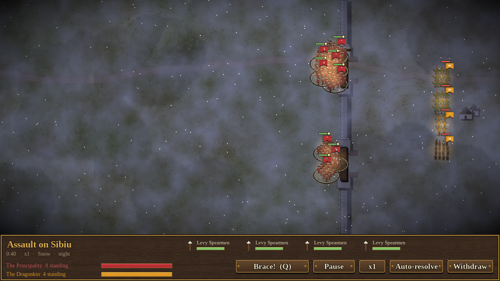

**Statul (M12)**
- **Tradiții** (tasta T sau butonul din panou): un arbore de cercetare cu 10 tradiții pe facțiune, 8 comune
  și 2 proprii. Se studiază una câte una: o plătești la început și o înveți în câteva anotimpuri. Aduc
  bonusuri permanente: taxe, hrană, soldă, ordine, mișcare, atac, apărare, moral, vindecare, echipament
  de asediu mai repede sau mai mulți recruți odată.
- **Acorduri comerciale:** aur în fiecare anotimp pentru amândoi partenerii, până când un război le rupe.
- **Căsătorii dinastice:** casele unite se plac mai mult, iar războiul împotriva rudelor e trădare.
  Strigoii nu se însoară.
- **Vasali:** un dușman zdrobit poate fi pus să îngenuncheze. Devine aliatul tău, îți plătește un sfert
  din taxe, iar provinciile lui se numără la victoria prin cucerire. Se eliberează dacă se rupe alianța sau
  începe un război.
- AI-ul face și el toate acestea.

**Legende (M13)**
- **Misiuni și eroi** (tasta L sau butonul **Legends**): fiecare legendă are două misiuni din basme. Când le
  împlinești, vine la capitala ta un erou unic:
  - Principality: Făt-Frumos (5 victorii) și Greuceanu (ia 2 provincii de la zmei);
  - Dragonkin: Zgripțuroaica (900 de aur în vistierie) și Spânul (răpește un moștenitor);
  - Fae Court: Ileana Cosânzeana (10 provincii) și Regina Zânelor (4 provincii de pădure);
  - Revenants: Baba Cloanța (12 provincii) și Marele Pricolici (12 victorii);
  - Outlaws: Iancu Jianu (ia 3 provincii de la Principality) și Pintea Viteazul (8 victorii);
  - Solomonari: Balaurul din lac (3 provincii de munte) și Al treisprezecelea școlar (700 de aur).

  Fereastra arată cât ai avansat și ce au câștigat celelalte curți.
- **Agenți:** spioni și preoți, cu nume după legendă (Spy/Priest, Imp Spy/Sorcerer, Will-o'-the-wisp/Herb
  Witch, Night Crow/Necromancer, Lookout/Wandering Monk, Storm Raven/Solomonar). Îi angajezi dintr-o provincie a ta, cel mult 2 din fiecare.
  - Merg oriunde, 3 provincii pe anotimp.
  - Spionul vede armatele din provincia lui și din vecini (chiar și ielele ascunse în păduri) și poate
    sabota o provincie dușmană: întârzie lucrările și îmbolnăvește garnizoana.
  - Preotul liniștește o provincie a ta (+2 ordine) sau stârnește tulburări la rival (-2 ordine).
  - O acțiune ratată îl poate costa pe agent viața. AI-ul își folosește și el agenții.

**Rejucabilitate (M14)**
- **Două legende noi**, jucabile:
  - **The Outlaws** (Haiducii) au capitala în Codrii Vlăsiei: Haiduc Braves (ambuscadă în pădure), Village
    Lads, Long Rifles, Mountain Riders și Haiduc Captain.
  - **The Solomonari** au capitala în Apuseni: Apprentices (scântei din toiag), Cave Wardens, Hailcallers
    (grindină din senin), Tamed Wyrms (balauri îmblânziți, zboară peste ziduri) și Elder Solomonar.

  Fiecare are figuri pe câmpul de luptă, emblemă, muzică (o baladă haiducească, o vrajă în minor
  armonic), două tradiții proprii, o clădire, două misiuni cu eroi și agenți.
- Răsculații care păzesc pământul neutru se numesc acum **Rebels**.
- **Opțiuni de start**, pe ecranul de alegere a legendei:
  - **Rivals:** de la 1 la 5 rivali, aleși la întâmplare. Pământurile celor care lipsesc le țin răsculații.
  - **Homelands:** istorice sau trase la sorți. La sorți, fiecare legendă primește patria, capitala și
    locurile de start ale alteia.
  - **Start:** 1400 (Epoca legendelor) sau 1450 (Epoca regilor): +200 de aur, două tradiții învățate,
    Barracks în capitală și un regiment de elită în fiecare armată de start.
  - **Lungimea războiului:** scurt (15 provincii), normal (21) sau lung (26).

  

  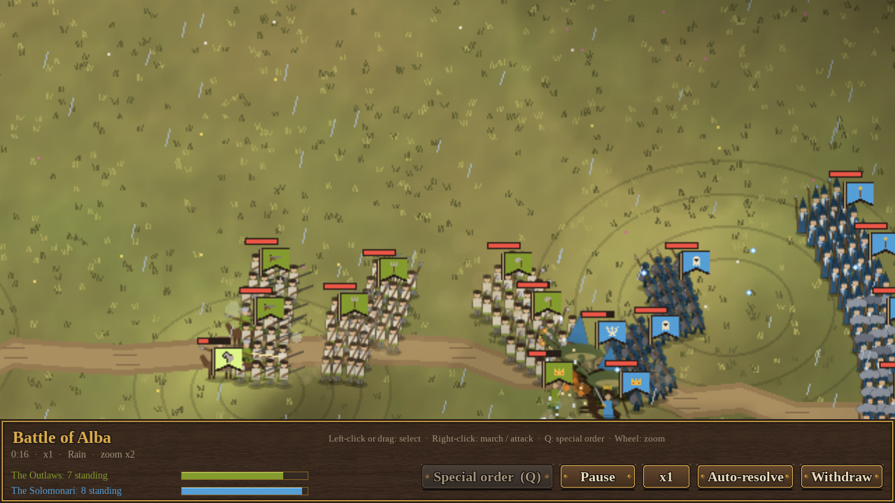

**Echilibru final (M15, AI contra AI, 360 de partide):** Outlaws 17,5%, Revenants 16,9%, Principality 16,9%,
Dragonkin 16,4%, Fae Court 15%, Solomonari 14,2% (3% fără învingător după 120 de ture). Ultimele
reglaje: Principality +35% venit și călăreți în armata de la Craiova, Hora ielelor 2% pe anotimp,
vremea solomonarilor -30% pentru săgeți și gloanțe, Cave Wardens la 60 de aur, haiducii iau 60 de aur
pe provincie.

**Finisaj (M15)**
- **Muzică:** fiecare temă e o doină liberă urmată de o horă, cu tobă, cobză și instrumentul legendei
  (vioară la haiduci și strigoi, clopote la Principat și la iele, tunete la solomonari), plus o temă de luptă.
- **Sunete în bătălie:** cornul de război (începutul luptei, ordinele speciale), salvele de săgeți,
  împușcăturile, scânteile și grindina solomonarilor, berbecul care sparge poarta.
- **Realizări** (*Achievements*, din meniul principal): 29 de fapte, de la prima victorie la câte o victorie
  cu fiecare dintre cele șase legende. Cele noi apar sus pe ecran, cu fanfară, și rămân în profil.

  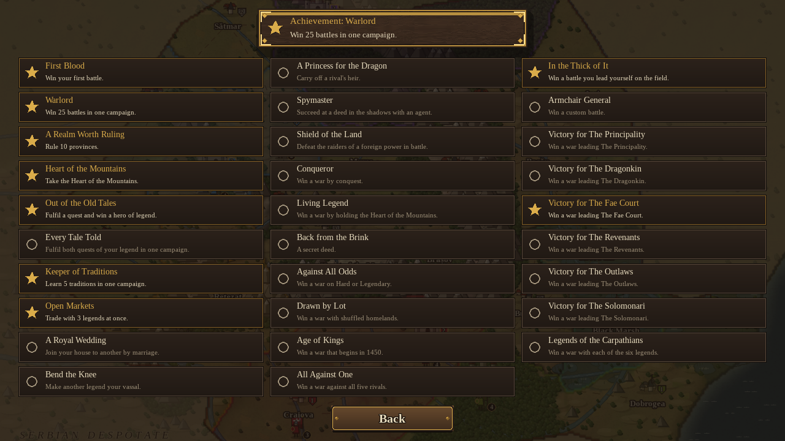

- **Executabil pentru Windows**, făcut cu PyInstaller (vezi mai jos), cu iconiță proprie: Inima Munților.

## Pentru dezvoltare

```bash
pip install -r requirements-dev.txt
python -m pytest                      # testele (regulile, harta și interfața, fără să deschidă fereastra)
python -m legendele --faction zmei    # sari peste ecranul de alegere a facțiunii
python -m legendele --faction iele --turns 4 --select-army --screenshot ecran.png
python tools/simulate.py 40 100       # AI contra AI pe 40 de partide, pentru echilibrare
python tools/duel.py                  # armate de același cost, facțiune contra facțiune
python tools/fair_costs.py            # cât valorează fiecare unitate în luptă, față de cost
```

### Executabilul

```bash
pip install pyinstaller
python tools/build_exe.py             # dist/LegendsOfTheCarpathians/ (+ un .zip de împărțit)
```

Pe Windows iese `LegendsOfTheCarpathians.exe`, pe Linux sau macOS un program nativ. Workflow-ul
`.github/workflows/build-windows.yml` face build-ul pe Windows (rulează mai întâi testele și verifică dacă
programul pornește) la fiecare tag de versiune (`v1.0`, ...) sau la cerere, din *Actions*. Pentru un tag,
arhiva se atașează și la release.

### Structura

```
legendele/
  game/        regulile jocului (fără pygame): date, stare, bătălii, economie, legende, diplomație, AI
  ui/          ecranele pygame: meniuri, harta, panoul, ferestrele; sunetul (audio.py)
  profile.py   setările și salvările jucătorului (~/.legendele)
  data/        JSON: factions.json, units.json, buildings.json, abilities.json, map.json
  assets/      sprite-uri opționale (vezi assets/README.md)
  mapshape.py  forma provinciilor, calculată din punctele din map.json
tools/
  build_adjacency.py   recalculează vecinii provinciilor după ce muți/adaugi una în map.json
  simulate.py          partide AI contra AI, cu statistici despre cine câștigă și cât durează
  duel.py, fair_costs.py   unelte de echilibrare a unităților
tests/
```

Ca să schimbi harta, editează pozițiile (`x`, `y`) sau proprietarii din `legendele/data/map.json`, apoi rulează
`python tools/build_adjacency.py`. Testele verifică dacă vecinii din fișier se potrivesc cu harta desenată.
